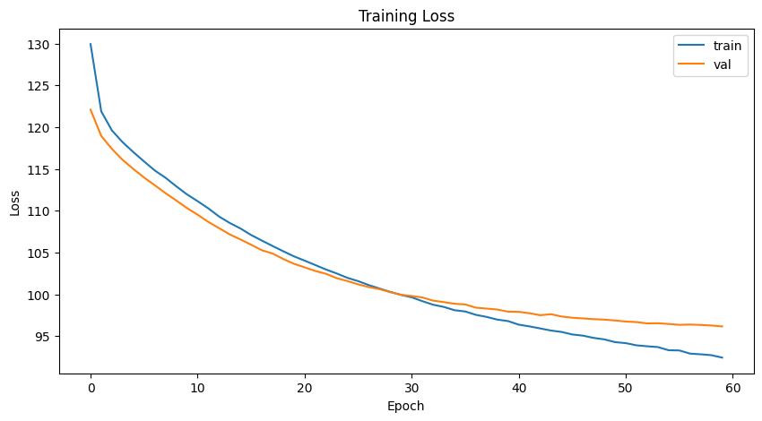
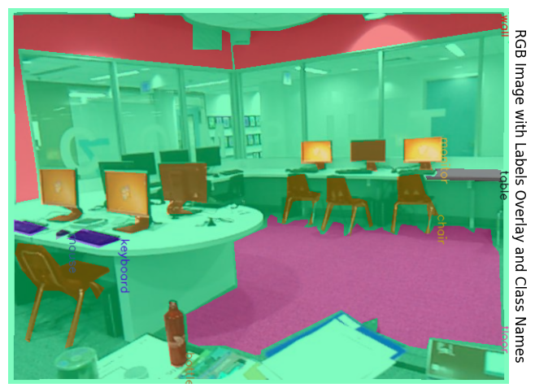

# AR Object Detection with DETR

## Table of Contents
- [Overview](#overview)
- [Features](#features)
- [Dataset](#dataset)
- [Installation](#installation)
- [Usage](#usage)
  - [Data Preparation](#data-preparation)
  - [Training](#training)
  - [Evaluation](#evaluation)
- [Model Architecture](#model-architecture)
- [Results](#results)
- [Contributing](#contributing)
- [License](#license)
- [Acknowledgements](#acknowledgements)

## Overview

This repository presents an end-to-end pipeline for semantic segmentation using the NYU Depth V2 dataset integrated with a Detection Transformer (DETR) model enhanced by depth information. The project leverages depth data to improve segmentation accuracy, offering a robust solution for depth-aware scene understanding.

## Features

- **Data Handling**: Efficient loading and preprocessing of the NYU Depth V2 `.mat` dataset.  
- **Model Integration**: Modification of ResNet-50 backbone to incorporate depth information for DETR.  
- **Custom Dataset \& DataLoader**: Tailored PyTorch `Dataset` and `DataLoader` for seamless data feeding.  
- **Data Augmentation**: Implements random horizontal flipping to enhance model generalization.  
- **Training Pipeline**: Comprehensive training loop with loss aggregation, optimizer setup, and learning rate scheduling.  
- **Evaluation Metrics**: Custom accuracy and Intersection over Union (IoU) computations to assess model performance.  
- **Visualization**: Tools to overlay segmentation labels on RGB images for qualitative analysis.  
- **Scalability**: Designed to handle large datasets efficiently with support for multi-worker data loading.

## Dataset

**NYU Depth V2** is a large-scale dataset for depth prediction and scene understanding, containing RGB-D images captured in indoor environments.

- **Total Classes**: 894  
- **Data Components**:
  - RGB Images  
  - Depth Maps  
  - Semantic Labels  
  - Class Names

**Note**: Ensure you have the `nyu_depth_v2_labeled.mat` file placed in the designated directory before proceeding.

## Installation

### Prerequisites

- Python 3.7 or higher  
- CUDA-enabled GPU (recommended for training)

### Clone the Repository

```bash
git clone https://github.com/yourusername/nyu-depth-detr.git
cd nyu-depth-detr
```

### Create a Virtual Environment

It's recommended to use a virtual environment to manage dependencies.

```bash
python3 -m venv venv
source venv/bin/activate  \# On Windows: venv\Scripts\activate
```

### Install Dependencies

```bash
pip install -r requirements.txt
```

**`requirements.txt`**:
```plaintext
h5py==3.8.0
numpy==1.23.5
matplotlib==3.6.2
opencv-python==4.7.0.72
torch==2.0.0
torchvision==0.15.1
tqdm==4.65.0
```

***Note***: For GPU support, ensure you install the appropriate versions of `torch` and `torchvision` as per [PyTorch's official installation guide](https://pytorch.org/get-started/locally/).

## Usage

### Data Preparation

1. **Download the NYU Depth V2 Dataset**:
   - Ensure you have the `nyu_depth_v2_labeled.mat` file. If not, download it from the [official source](https://cs.nyu.edu/~silberman/datasets/nyu_depth_v2.html).

2. **Place the Dataset**:
   - Move the `.mat` file to the project directory or specify the correct path in the script.

### Training

Execute the training script to start the training process.

```bash
python main.py --mode train --data_path path/to/nyu_depth_v2_labeled.mat --epochs 60 --batch_size 4
```

**Arguments**:
- `--mode`: Operation mode (`train`, `evaluate`, `test`)  
- `--data_path`: Path to the `.mat` dataset file  
- `--epochs`: Number of training epochs  
- `--batch_size`: Batch size for training

**Example**:

```bash
python main.py --mode train --data_path ./data/nyu_depth_v2_labeled.mat --epochs 60 --batch_size 4
```

### Evaluation

After training, evaluate the model on the validation or test set.

```bash
python main.py --mode evaluate --data_path path/to/nyu_depth_v2_labeled.mat --checkpoint path/to/checkpoint.pth
```

**Arguments**:
- `--mode`: `evaluate` or `test`  
- `--data_path`: Path to the `.mat` dataset file  
- `--checkpoint`: Path to the trained model checkpoint

### Testing

To test the model and visualize results:

```bash
python main.py --mode test --data_path path/to/nyu_depth_v2_labeled.mat --checkpoint path/to/checkpoint.pth
```

**Visualization**:

The script includes functions to overlay segmentation labels on RGB images, allowing for qualitative assessment of model performance.

## Model Architecture

### Detection Transformer (DETR) with Depth Integration

- **Backbone**: Modified ResNet-50 to accept 4-channel input (RGB + Depth).  
- **Transformer**: Standard DETR transformer with 6 encoder and 6 decoder layers.  
- **Head**: Classification and bounding box regression heads adapted for semantic segmentation.  
- **Matcher**: Hungarian Matcher for optimal bipartite matching between predictions and ground truth.

### Modifying ResNet-50 for Depth

The first convolutional layer of ResNet-50 is altered to accept an additional depth channel. The weights for the fourth channel are initialized as the mean of the existing RGB channels to integrate depth information effectively.

```python
def modify_resnet_for_4_channels():
    model = resnet50(weights=ResNet50_Weights.IMAGENET1K_V1)
    old_conv = model.conv1
    new_conv = nn.Conv2d(4, old_conv.out_channels,
                         kernel_size=old_conv.kernel_size,
                         stride=old_conv.stride,
                         padding=old_conv.padding,
                         bias=(old_conv.bias is not None))
    new_conv.weight.data[:, :3, :, :] = old_conv.weight.data
    new_conv.weight.data[:, 3:4, :, :] = old_conv.weight.data.mean(dim=1, keepdim=True)
    if old_conv.bias is not None:
        new_conv.bias.data = old_conv.bias.data
    model.conv1 = new_conv
    return model
```

## Results

After training for 60 epochs, the model achieves the following

### Loss Curves



### Sample Predictions




## License

This project is licensed under the [MIT License\](LICENSE).

## Acknowledgements

- [DETR: End-to-End Object Detection with Transformers\](https://github.com/facebookresearch/detr)  
- [NYU Depth V2 Dataset\](https://cs.nyu.edu/~silberman/datasets/nyu_depth_v2.html)  
- [PyTorch\](https://pytorch.org/)  
- [OpenCV\](https://opencv.org/)  
- [Matplotlib\](https://matplotlib.org/)

---

*Feel free to reach out via [anurag.hruday@gmail.com](mailto:anurag.hruday@gmail.com) for any questions or collaborations.*


